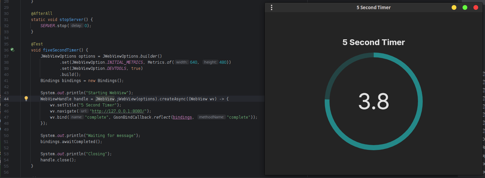

# JWebView
An experimental cross-platform WebView library for Java 8+ based
on [webview](https://github.com/webview/webview/) ``0.12.0`` (C/++).
Build GUIs with HTML/CSS!




## Why not [webview_java](https://github.com/webview/webview_java)?

- ``webview_java`` does NOT compile ``webview`` as part of its build process.
  It relies on pre-built binaries stored in the repo directly. This
  makes it harder to maintain and trust. This repo does not contain
  any pre-built libraries and will compile everything from source
  when cloning locally.

- ``webview_java`` uses JNA, which is inherently somewhat slower than JNI.
  This library includes a C stub which makes efficient and deliberate adaptations
  between Java and C, built on-demand for the host platform.

- ``webview_java`` has a lackluster error handling strategy due
  to its usage of JNA. With this library, any exceptions raised by
  a binding are losslessly delivered to the JS runtime.

## Getting JWebView
Releases are published to Maven Central.
See [Supported Platforms](#supported-platforms) for more info.

### Gradle (Kotlin)
```kotlin
implementation("io.github.wasabithumb:jwebview:VERSION")
runtimeOnly("io.github.wasabithumb:jwebview-natives-all:VERSION")
```

### Gradle (Groovy)
```groovy
implementation 'io.github.wasabithumb:jwebview:VERSION'
runtimeOnly 'io.github.wasabithumb:jwebview-natives-all:VERSION'
```

### Maven
```xml
<dependency>
    <group>io.github.wasabithumb</group>
    <artifactId>jwebview</artifactId>
    <version>VERSION</version>
    <scope>compile</scope>
</dependency>
<dependency>
    <group>io.github.wasabithumb</group>
    <artifactId>jwebview-natives-all</artifactId>
    <version>VERSION</version>
    <scope>runtime</scope>
</dependency>
```

## Basic Usage

### Synchronous
```java
try (WebView wv = JWebView.jWebView().create()) {
    wv.setTitle("Your Title Here");
    wv.navigate("https://example.org/");
    wv.run(); // Blocks until the window is closed
}
```

### Asynchronous
```java
WebViewHandle wvh = JWebView.jWebView().createAsync((WebView wv) -> {
    wv.setTitle("Your Title Here");
    wv.navigate("https://example.org/");
    // Do NOT call #run here!
});

// To modify the window:
wvh.use((WebView wv) -> {
    wv.eval("console.log(\"hello world!\")");
});

// To close the window:
wvh.close();
```

## Configuring
Multiple configuration options are available through 
usage of ``JWebViewOptions``. This configures the ``JWebView`` instance
and applies to all ``WebView``s it creates.

```java
JWebView jwv = JWebView.jWebView(JWebViewOptions.builder()
        // Enable developer tools
        .set(JWebViewOption.DEVTOOLS, true)
        // Set initial window size to 640x480
        .set(JWebViewOption.INITIAL_METRICS, Metrics.of(640, 480))
        // ...
);
```

## Bindings
Bindings are global functions added to the JS environment which
call user Java methods. Below are 2 supported approaches.

### Raw
The ``WebView#bind`` method creates a new binding which accepts
a JSON array of arguments and returns a JSON value:
```java
wv.bind("echo", (String args) -> {
    return args;
});
```
```js
echo("1", 2, "3"); // [ "1", 2, "3" ]
```

### Gson
The ``jwebview-bridge`` artifact (optional) provides Gson-powered
utilities to alleviate the binding creation process:

```java
class MultiplyBind {
    
    int multiply(int a, int b) {
        return a * b;
    }
    
}
```
```java
wv.bind(
        // Name in JS
        "multiply", 
        GsonBindCallback.reflect(
                // Object to execute the method on
                new MultiplyBind(), 
                // Method to execute
                "multiply"
        )
);
```
```js
multiply(7, 3); // 21
```

## Supported Platforms
|                            | Windows | Linux (GNU) | MacOS |
|:--------------------------:|:-------:|:-----------:|:-----:|
|   AMD64 (a.k.a. x86_64)    |    ✅    |      ✅      |   ✅   |
| ARM64 (a.k.a. Aarch64, M1) |    ❌    |      ❌      |   ✅   |

### Artifact Tree
- ``jwebview-natives-all``
  - ``jwebview-natives-windows``
    - ``jwebview-natives-windows-amd64`` 
  - ``jwebview-natives-linux``
    - ``jwebview-natives-linux-amd64``
  - ``jwebview-natives-macos``
    - ``jwebview-natives-macos-amd64``
    - ``jwebview-natives-macos-arm64``

## License
```text
   Copyright 2025 Xavier Pedraza

   Licensed under the Apache License, Version 2.0 (the "License");
   you may not use this file except in compliance with the License.
   You may obtain a copy of the License at

       http://www.apache.org/licenses/LICENSE-2.0

   Unless required by applicable law or agreed to in writing, software
   distributed under the License is distributed on an "AS IS" BASIS,
   WITHOUT WARRANTIES OR CONDITIONS OF ANY KIND, either express or implied.
   See the License for the specific language governing permissions and
   limitations under the License.
```